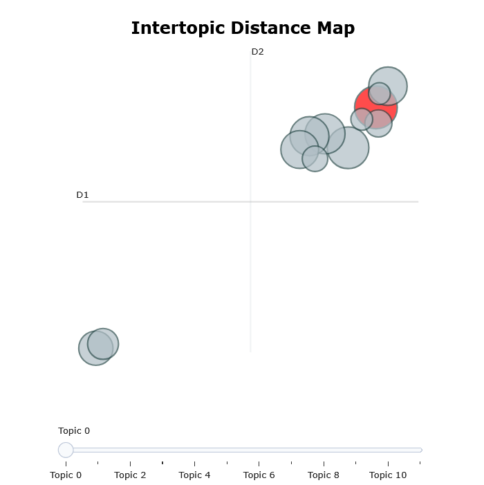
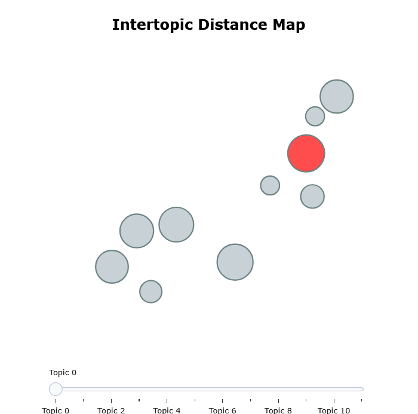
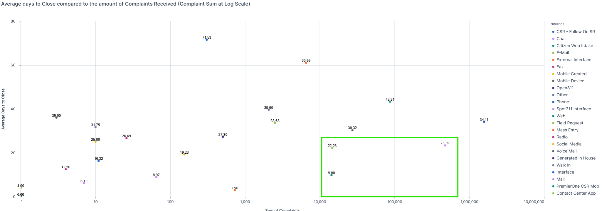
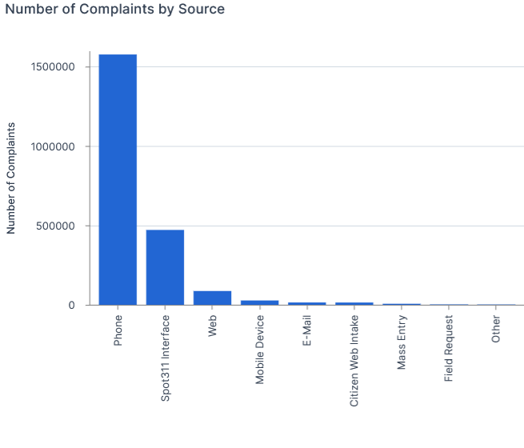
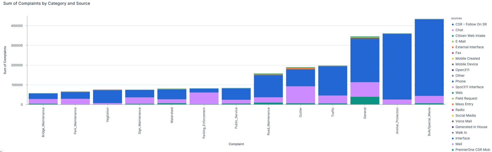

To Access the notebook and Streamlit application for this project to try it yourself or see the method behind the madness follow the public notebook link below. You will be prompted to create a deepnote account but once in you can run the streamlit application mentioned in detail below.

<a href="https://deepnote.com/workspace/Thebes-04bb199c-9f99-4f06-8d46-87b9a1a60fee/project/Austin-Complaints-85a12285-dd92-430d-b754-ab647bcbcd58/notebook/austinincidents-06677c1b7dd541628be07c979af7c892?utm_source=share-modal&utm_medium=product-shared-content&utm_campaign=notebook&utm_content=85a12285-dd92-430d-b754-ab647bcbcd58">Deepnote Notebook 🚀</a>

## Project Description
This project utilizes BERT's NLP to categorize complaint descriptions and expose the model in a dashboard interface that allows users to provide a complaint and see how it would be categorized for the City of Austin, Texas and derive insights with those categories. Data was collected from BigQuery Public Datasets

## Context
Each record represents one of 387 unique complaints against a dataset containing 2 million complaints from the Austin, Texas Emergency Services Dispatch. Within each record the status of the complaint, location, and critical time stamps are recoded.

## Core Competencies Exercised
- Query and Store Data from Cloud Source with SQL (BigQuery/Google Cloud Storage)
- Unsupervised Learning
    - Natural Language Processing (NLP) with BERT
- Data Visualization
- Model Storage for Real Time Inference
- Model Exposed on Dashboard (Streamlit in DeepNote)

I aimed to replicate various responsibilities of a Data Scientist in this project. Primarily the Collection of data in a cloud environment and pushing to a disparate Integrated Development Environment (IDE) that would best suit the project goals. Deepnote was chosen for it's compute capability (given the size of the data) as well as easily integrated elements (streamlit and Github).

## Streamlit Integration
After Packaging the model into a pickle file we exposed the model to a streamlit application so that any user can input their own natural language category and see how it should be categorized. In practical application this could be added to the web interface that intake personnel use as a suggestion tool to increase data quality on complaints processed. Below is  a screenshot of the Streamlit application before and after entering a category.

## Discussion
Originally this project aimed to utilize all 387 complaint categories to cluster numerical aggregates to find similarities between each category. These aggregates were average distance from Downtown, average Days to Close, and Number of Complaints. 

After finding that there was no good route to optimal clusters using KMeans, and Hierarchical Clustering we transitioned to reduce the category dimension using NLP. Cleaning the category labels proved to be challenging as there was no consistent use of delimeters, some categories were prefixed with unexplainable codes, and confusing terminonolgy. After a few rounds of regex replacements we have more acceptable documents for BERT to utilize.

After processing them through BERT we see that there are two distinct categories and within each of these the categories we were able to parse them down alittle more. The following 11 categories were derived:

- General
- Watershed
- Bulk/Special_Waste
- Road Maintenance
- Animal Protection
- Bridge Maintenance
- Traffic
- Sign Maintenance
- Park Maintenance
- Vegitation
- Parking Enforcement
- Public Service

Creating a Intertopic Distance Map you'll see in the left image is the overall view of NLP clustering and the right is zoomed into the top right quadrant of the same chart.

 

## Analysis
After categorizing the results we conclude the following regarding the Source of complaints and Category of Complaints

- Citizen Web Intake, E-Mail, and the Spot 311 application have the quickest resolution time. (Fig 1)
- Complaints sourced from a phone call are the most popular categories by far. (Fig 2)
- Trash, Animal Disposal/Control, and General calls for service are the most common complaints with a dominating amount of Spot 311, and Phone call source type. (Fig 3)

Figure 1. Days Closed by Number of Complaints at Log Scale.

Figure 2. Complaints by Source (All Sources close to 0 intentionally left out)

Figure 3.

## Conclusion
Considering the high degree of phone intake and the relatively comparable days to complete this along with the Spot 311 application are the best ways to submit a complaint for resolution. Furthermore, the City of Austin should prioritize these for resource allocation. 

## 
